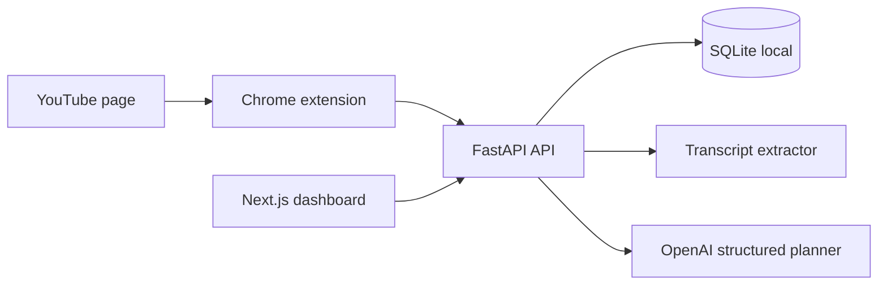

# Action Engine Architecture

## Current MVP

## Data Flow

1. The extension reads the current YouTube tab metadata.
2. It posts the capture to `/api/ingest/browser-capture`.
3. The API validates the URL and stores a `content_items` row.
4. The user opens the dashboard and triggers processing.
5. The API fetches captions, calls the planner, saves the plan and tasks.
6. The dashboard tracks completion and enforces gatekeeper settings.

## Scale Path

- Replace SQLite with PostgreSQL by changing `DATABASE_URL`.
- Move `/process` work into Redis + Celery when jobs exceed 60 seconds.
- Add Google Sheets logging for founder analytics: captures, plans created, tasks completed, and blocked gatekeeper attempts.
- Add source connectors after the extension proves usage: YouTube playlist sync, then Instagram/Facebook if compliant access is available.
